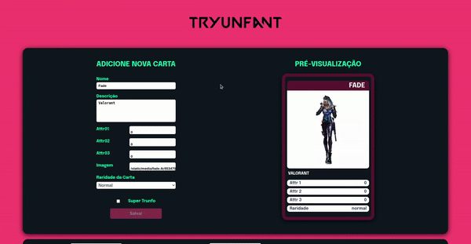

# Tryunfant

### PT - BR

Nesse projeto, eu fui capaz de:

- Ler o estado de um componente e usá-lo para alterar o que exibimos no browser
- Inicializar um componente, dando a ele um estado pré-definido
- Atualizar o estado de um componente
- Capturar eventos utilizando a sintaxe do React
- Criar formulários utilizando sintaxe JSX com as tags: input, textarea, select, form, checkbox
- Transmitir informações de componentes filhos para componentes pais via callbacks

### EN

In this project, I was able to:

- Read the state of a component and use it to change what we display in the browser
- Initialize a component, giving it a predefined state
- Update the state of a component
- Capture events using React syntax
- Create forms using JSX syntax with tags: input, textarea, select, form, checkbox
- Pass information from child components to parent components via callbacks

#### Project Link: https://project-tryunfo-one.vercel.app/
